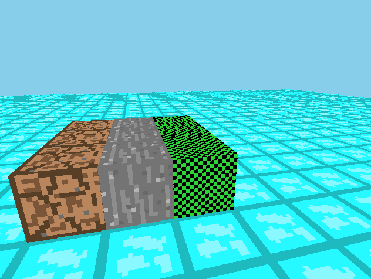

# Shellcraft

In 6 days, I attempted to recreate minecraft from scratch using libgdx, along with building terminal multiplexer components for certain blocks. Intuitively, these block components work like chrome tabs, except each tab is created as a block, which is opened similarly to how you would open a crafting table. Image of the basic game below.

